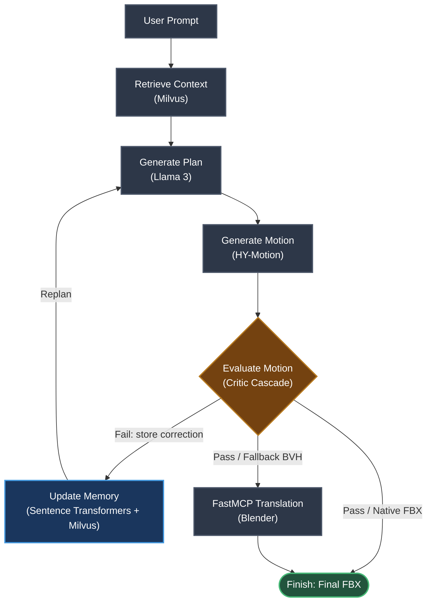

# GenAnimPipeline

A multi-agent text-to-motion generative pipeline that converts natural-language prompts into game-engine-ready FBX animation files. The system orchestrates multiple AI models through a LangGraph workflow running on WSL2, with a native Windows Blender server as a fallback for asset translation.

```
"A character performs a heavy broadsword swing."
        |
        v
  [ graph.py LangGraph Orchestrator ]
        |
        +---> Milvus Vector DB (retrieve historical corrections)
        +---> Llama-3 via Ollama (symbolic motion plan)
        +---> HY-Motion-1.0 DiT (3D animation generation)
        +---> Critic (quality gate)
        |       |
        |       +-- reject --> Milvus Vector DB (store new correction)
        |                           |
        |                           +--> replan loop
        |
        +---> Blender via MCP (BVH-to-FBX fallback)
        |
        v
  final_animation.fbx
```

## Architecture Overview

The pipeline runs as a hybrid WSL2/Windows system:

| Component | Runs On | Purpose |
|---|---|---|
| `graph.py` (LangGraph) | WSL2 | Central orchestrator -- routes prompts through all models |
| Milvus vector database | WSL2 (Docker) | Stores motion correction embeddings for context retrieval |
| Ollama + Llama 3 | Windows host | Decomposes prompts into structured motion plans |
| HY-Motion-1.0 | WSL2 | Diffusion transformer that generates 3D skeleton animation |
| Blender + FastMCP server | Windows host | Safety-net BVH-to-FBX converter (only when needed) |

All model-specific settings are centralized in configuration blocks at the top of `graph.py` and `mcp_server/translate_to_fbx.py`. See [Model Configuration](#model-configuration) for details on swapping or upgrading any model.

---

## Models in the Pipeline

### 1. Planner LLM -- Symbolic Motion Decomposition

| | |
|---|---|
| **Current model** | Meta Llama 3 (8B) via Ollama |
| **Type** | Large Language Model (decoder-only transformer) |
| **Pipeline stage** | Node 2: `generate_plan` |
| **Runs on** | Windows host, served by Ollama on port 11434 |
| **Config variables** | `PLANNER_MODEL`, `OLLAMA_PORT` in `graph.py` |

**Role in the pipeline:**
The planner receives the user's text prompt (e.g., "A character performs a heavy broadsword swing") and produces a structured JSON motion plan with Laban movement analysis properties:

```json
{
  "action_type": "swing",
  "spatial_level": "high",
  "speed": "slow"
}
```

This symbolic plan gives the downstream motion generator structured context beyond the raw text, helping it produce more accurate animations. If the LLM is unreachable, the pipeline falls back to a safe default plan and continues.

**Requirements:**
- Ollama installed on Windows with `OLLAMA_HOST=0.0.0.0` set as a system environment variable
- The model pulled: `ollama pull llama3`
- ~4.7 GB disk / ~6 GB VRAM for the 8B Q4 quantization

**How to replace or upgrade:**
1. Pull a different model: `ollama pull <model-name>` (e.g., `mistral`, `gemma2`, `phi3`, `llama3.1`)
2. Update one line in `graph.py`:
   ```python
   PLANNER_MODEL = "mistral"  # or any Ollama-compatible model name
   ```
3. No other code changes are needed. The Ollama API is model-agnostic -- the same `/api/generate` endpoint works for all models.

> **VRAM isolation:** The pipeline passes `"keep_alive": 0` in the Ollama API request, which tells Ollama to immediately unload the planner model from VRAM after responding. This frees the GPU before HY-Motion starts its diffusion pass. For full isolation (the planner never touches the GPU at all), set the Windows system environment variable `OLLAMA_NUM_GPU=0` and restart Ollama. This forces CPU-only inference for the planner -- adding only 2-3 seconds for a single JSON response, negligible compared to the diffusion pass.
>
> **Upgrade considerations:** Larger models (70B+) produce better plans but require more VRAM. Quantized models (Q4/Q5) offer a good balance. If using GPU inference for the planner, the `keep_alive: 0` parameter ensures VRAM is released before HY-Motion loads.

---

### 2. Motion Diffusion Transformer -- 3D Animation Generation

| | |
|---|---|
| **Current model** | Tencent HY-Motion-1.0 (1.0B parameters) |
| **Type** | Diffusion Transformer (DiT) with Flow Matching |
| **Pipeline stage** | Node 3: `generate_motion` |
| **Runs on** | WSL2, invoked via `local_infer.py` |
| **Config variables** | `MOTION_ENGINE_DIR`, `MOTION_ENGINE_CHECKPOINT`, `MOTION_ENGINE_SCRIPT` in `graph.py` |

**Role in the pipeline:**
This is the core generative model. It takes the text prompt and duration, runs a diffusion process over learned motion distributions, and outputs skeleton-based 3D character animation data (SMPL-H format, 52 joints at 30 FPS). HY-Motion produces both an FBX file (game-engine ready) and an NPZ file (raw SMPL-H pose parameters: axis-angle rotations for 52 joints + root translation per frame). The pipeline copies both: FBX to `final_animation.fbx` (primary output) and NPZ to `temp_motion.npz` (used by the critic cascade via the `SmplhMocap` adapter for kinematic and visual evaluation). If only BVH is produced (e.g., from a different motion engine), it is copied to `temp_motion.bvh` and the Blender fallback is triggered.

**Sub-models bundled inside HY-Motion:**

| Sub-model | Path | Purpose | Status |
|---|---|---|---|
| **CLIP ViT-L/14** | `ckpts/clip-vit-large-patch14/` | Text encoder -- converts the prompt into embeddings the diffusion model understands | Active (required) |
| **Qwen3-8B** | `ckpts/Qwen3-8B/` | Prompt rewriter and duration estimator -- the internal LLM | **Bypassed** via VRAM patch |
| **Text2MotionPrompter** | `ckpts/Text2MotionPrompter/` | Alternative prompt rewriting adapter | **Bypassed** via VRAM patch |
| **HY-Motion DiT** | `ckpts/tencent/HY-Motion-1.0/latest.ckpt` (~3.9 GB) | The main diffusion transformer checkpoint | Active (core model) |

> **VRAM Bypass Patch:** The internal Qwen3-8B (8B parameter LLM) is disabled via a surgical patch to `hymotion/prompt_engineering/prompt_rewrite.py`. Without this patch, the model would require ~40 GB VRAM just for the text rewriter. Instead, our pipeline reads the duration from `graph.py`'s `GLOBAL_DURATION` config via an environment variable, and passes the prompt through unmodified. See Phase 5 of `WALKTHROUGH.md` for the exact patch.

**Requirements:**
- ~26 GB VRAM for the standard 1.0B model (less with the VRAM bypass active)
- PyTorch Nightly with CUDA 13.0+ for RTX 50-series (or stable PyTorch + CUDA 12.x for 30/40-series)
- Git LFS to pull the actual mesh files (not just LFS pointers)

**Input format:**
The pipeline writes a prompt file in HY-Motion's expected format:
```
<text prompt>#<duration in seconds>#<seed>
```
Example: `A character performs a heavy broadsword swing.#5#999`

**How to replace or upgrade:**
1. Clone or download the new motion model to a directory accessible from WSL2.
2. Update three variables in `graph.py`:
   ```python
   MOTION_ENGINE_DIR = "/mnt/e/GenAnimPipeline/NewMotionModel"
   MOTION_ENGINE_CHECKPOINT = "path/to/checkpoint"
   MOTION_ENGINE_SCRIPT = "inference.py"  # the new model's entry script
   ```
3. Adapt the prompt format in `generate_motion_node()` to match the new model's expected input. The current format (`text#duration#seed`) is HY-Motion-specific.
4. Ensure the new model outputs `.fbx` or `.bvh` files to a predictable output directory. The smart fallback logic in `generate_motion_node()` scans the output directory recursively for both formats.

> **Upgrade path:** HY-Motion-1.0-Lite (0.46B parameters) is available for lower-VRAM setups. To use it, change `MOTION_ENGINE_CHECKPOINT` to `"ckpts/tencent/HY-Motion-1.0-Lite"`. Future motion models (e.g., MotionDiffuse, MDM, MLD) can be integrated by pointing to their directory and adapting the prompt format.

---

### 3. Embedding Model -- Vector Memory Retrieval

| | |
|---|---|
| **Current model** | 384-dimensional sentence embeddings (e.g., `all-MiniLM-L6-v2`) |
| **Type** | Sentence Transformer / Text Embedding Model |
| **Pipeline stage** | Node 1: `retrieve_context` (query) + offline ingestion (write) |
| **Runs on** | Wherever embeddings are generated before insertion into Milvus |
| **Config variables** | `MILVUS_HOST`, `MILVUS_PORT`, `MILVUS_COLLECTION` in `graph.py` |

**Role in the pipeline:**
The Milvus vector database stores historical motion correction rules as 384-dimensional embeddings. When the pipeline starts, `retrieve_context_node` connects to Milvus and loads relevant corrections so the planner can avoid known failure modes. The embedding model is used at ingestion time (when adding new correction rules) to convert text into vectors.

**Requirements:**
- Milvus running via Docker Compose (`docker-compose.yml`) on `localhost:19530`
- The `motion_corrections` collection initialized via `init_milvus.py`
- An embedding model that produces 384-dim vectors for ingestion (e.g., `sentence-transformers/all-MiniLM-L6-v2`)

**How to replace or upgrade:**
- **Changing the vector database:** Update `MILVUS_HOST`, `MILVUS_PORT`, and `MILVUS_COLLECTION` in `graph.py`. The `retrieve_context_node` uses the PyMilvus client, so any Milvus-compatible backend works.
- **Changing the embedding model:** Update the ingestion script to use a different model. If the new model produces a different vector dimension, update `init_milvus.py` to match:
  ```python
  FieldSchema(name="embedding", dtype=DataType.FLOAT_VECTOR, dim=768)  # e.g., for a 768-dim model
  ```
  Then recreate the Milvus collection.

> **Note:** The embedding model is used at two points in the pipeline: **read** — `retrieve_context_node` loads the `motion_corrections` collection at the start of each run; **write** — `update_memory_node` encodes every critic rejection into a 384-dim vector via `all-MiniLM-L6-v2` and inserts it into Milvus before replanning, making the system continuously learn from its mistakes.

---

### 4. Critic -- 4-Stage Evaluation Cascade

| | |
|---|---|
| **Current model** | Llama 3 (semantic) + LLaVA (visual) + Human-in-the-Loop |
| **Type** | Multi-stage validation funnel (physics → LLM → vision → human) |
| **Pipeline stage** | Node 4: `evaluate_motion` |
| **Runs on** | WSL2 (Stages 1, 2, 3 compute) + terminal blocking prompt (Stage 4) |
| **Config variables** | `CRITIC_SCORE_THRESHOLD`, `MAX_ITERATIONS`, `VISION_MODEL` in `graph.py` |

**Role in the pipeline:**
The critic evaluates generated motion quality on a 0.0-1.0 scale through four sequential stages. If any stage fails, it immediately returns its score and skips all heavier downstream stages. The `route_evaluation` function uses the final score:
- Score >= `CRITIC_SCORE_THRESHOLD` (0.85): Accept the animation and proceed to output.
- Score < threshold and iterations < `MAX_ITERATIONS` (3): Loop back to `generate_plan` for another attempt.
- Iterations >= `MAX_ITERATIONS`: Accept regardless and proceed.

**The 4 stages:**

| Stage | What it checks | Fail score | Failure condition |
|---|---|---|---|
| **1 - Kinematic Gatekeeper** | Forward-kinematics foot-sliding check. Detects when a grounded foot (Y near 0) drifts in XZ between frames. Thresholds are relative to character height. | 0.1 | > 15% of grounded frames exceed the XZ drift threshold |
| **2 - Semantic Logician** | Samples the BVH every 10 frames, extracts Spine/Arm positions and rotations into a lightweight JSON, and sends it to Llama 3 with the original prompt. Asks the LLM whether the trajectory matches the semantic intent. | 0.4 | LLM determines `matches: false` |
| **3 - Art Director** | Renders a 2×2 grid of 4 skeleton keyframes using matplotlib 3D and sends the PNG image to LLaVA. Prompts the vision model to score weight, fluidity, and pose dynamics out of 1.0. | LLaVA's score (< 0.85) | LLaVA scores below `CRITIC_SCORE_THRESHOLD` |
| **4 - Human Sign-Off** | Prints the prompt, AI score, feedback, and file path to the terminal in a visible block. Waits for `Y` or `N` via `input()`. If rejected, prompts for a reason. | 0.0 + custom reason | User presses N |

Stages 2 and 3 fail gracefully if Ollama is asleep or times out -- they pass with a reduced confidence score (0.7) rather than blocking the pipeline.

**Requirements:**
- `pip install bvh matplotlib numpy` (WSL2 environment -- see Phase 4)
- LLaVA model pulled in Ollama: `ollama pull llava`
- LLaVA requires ~4-8 GB VRAM (runs on Windows host via the same Ollama endpoint as the planner)

**Data source:**
The critic accepts two input formats, tried in this order:
1. **BVH file** (parsed directly with the `bvh` library) -- used if the motion engine produces a `.bvh` file.
2. **SMPL-H NPZ file** (parsed via the `SmplhMocap` adapter in `graph.py`) -- used when HY-Motion outputs FBX+NPZ without a BVH. The adapter converts axis-angle rotations to ZXY Euler angles and exposes the same API as the `bvh` library, so all four stages work identically on both formats. Spatial values are scaled from metres to centimetres to match the kinematic thresholds.

**How to swap the vision model:**
Change `VISION_MODEL` in `graph.py`:
```python
VISION_MODEL = "llava:13b"  # or "bakllava", "llava:34b", etc.
```

**How to swap the semantic model:**
The semantic logician reuses `PLANNER_MODEL` and `OLLAMA_PORT`, so swapping the planner automatically upgrades Stage 2 as well.

---

### 5. Blender -- Mesh Translation Engine

| | |
|---|---|
| **Current version** | Blender 5.0 |
| **Type** | 3D modeling/animation application (not an AI model) |
| **Pipeline stage** | Node 5: `execute_mcp` (conditional -- only triggered for BVH fallback) |
| **Runs on** | Windows host, invoked headlessly by the FastMCP server |
| **Config variables** | `BLENDER_EXE`, `BLENDER_SCRIPT`, `SERVER_PORT` in `mcp_server/translate_to_fbx.py` |

**Role in the pipeline:**
When HY-Motion produces only a `.bvh` file (raw skeleton data without mesh binding), the pipeline calls the FastMCP Blender server on the Windows host. Blender imports the BVH, bakes all bone keyframes, and exports a game-engine-ready FBX. This is the safety net, not the primary path.

**How to replace or upgrade:**
1. Install the new Blender version on Windows.
2. Update `mcp_server/translate_to_fbx.py`:
   ```python
   BLENDER_EXE = r"D:\Blender Foundation\Blender 5.1\blender.exe"
   ```
3. Verify the new version's Python API hasn't changed the BVH import or FBX export operators used in `blender_retarget.py`.

---

## Model Configuration

All model settings are centralized in configuration blocks. Here is a quick reference for swapping any component:

### graph.py -- Pipeline Configuration Block

```python
# -- Planner LLM --
PLANNER_MODEL = "llama3"    # Any Ollama-pulled model name
VISION_MODEL = "llava"      # LLaVA vision model for Stage 3 art direction
OLLAMA_PORT = 11434         # Ollama API port

# -- Motion Engine --
MOTION_ENGINE_DIR = "/mnt/e/GenAnimPipeline/HY-Motion-1.0"
MOTION_ENGINE_CHECKPOINT = "ckpts/tencent/HY-Motion-1.0"
MOTION_ENGINE_SCRIPT = "local_infer.py"

# -- Vector Memory --
MILVUS_HOST = "localhost"
MILVUS_PORT = "19530"
MILVUS_COLLECTION = "motion_corrections"

# -- Critic Thresholds --
CRITIC_SCORE_THRESHOLD = 0.85
MAX_ITERATIONS = 3
```

### mcp_server/translate_to_fbx.py -- Server Configuration Block

```python
BLENDER_EXE = r"D:\Blender Foundation\Blender 5.0\blender.exe"
BLENDER_SCRIPT = r"E:\GenAnimPipeline\mcp_server\blender_retarget.py"
SERVER_PORT = 8000
```

### Quick Reference Table

| What to swap | Config file | Variables | Notes |
|---|---|---|---|
| Planner LLM | `graph.py` | `PLANNER_MODEL`, `OLLAMA_PORT` | `ollama pull <model>` first; also upgrades Stage 2 critic |
| Vision model (critic Stage 3) | `graph.py` | `VISION_MODEL` | `ollama pull llava:13b` etc.; any multimodal Ollama model |
| Motion engine | `graph.py` | `MOTION_ENGINE_DIR`, `_CHECKPOINT`, `_SCRIPT` | Adapt prompt format in `generate_motion_node()` |
| Motion engine variant | `graph.py` | `MOTION_ENGINE_CHECKPOINT` | e.g., `ckpts/tencent/HY-Motion-1.0-Lite` for lighter model |
| Embedding model | `init_milvus.py` | `dim=384` field schema | Recreate Milvus collection if dimension changes |
| Critic thresholds | `graph.py` | `CRITIC_SCORE_THRESHOLD`, `MAX_ITERATIONS` | Raise threshold for stricter gating; lower for faster iteration |
| Blender version | `translate_to_fbx.py` | `BLENDER_EXE` | Check API compatibility for BVH/FBX ops |
| MCP server port | Both files | `MCP_SERVER_PORT` / `SERVER_PORT` | Must match between `graph.py` and `translate_to_fbx.py` |

---

## File Structure

```
GenAnimPipeline/
  graph.py                  # LangGraph orchestrator (main entry point)
  init_milvus.py            # One-time Milvus collection setup
  docker-compose.yml        # Milvus deployment (etcd + minio + milvus)
  WALKTHROUGH.md            # Full deployment guide (Phases 1-7)
  README.md                 # This file
  mcp_server/
    translate_to_fbx.py     # FastMCP Blender translation server
    blender_retarget.py     # Blender Python script for BVH-to-FBX
    venv/                   # Python venv for the MCP server
  HY-Motion-1.0/            # Cloned motion generation model
    local_infer.py          # Inference entry point
    hymotion/               # Model source code (contains VRAM bypass patch)
    ckpts/                  # Model checkpoints (CLIP, Qwen3-8B, DiT)
  volumes/                  # Docker volumes for Milvus data persistence
```

## Getting Started

See [WALKTHROUGH.md](WALKTHROUGH.md) for the complete setup guide covering all seven deployment phases, from WSL2 configuration through first pipeline run.
